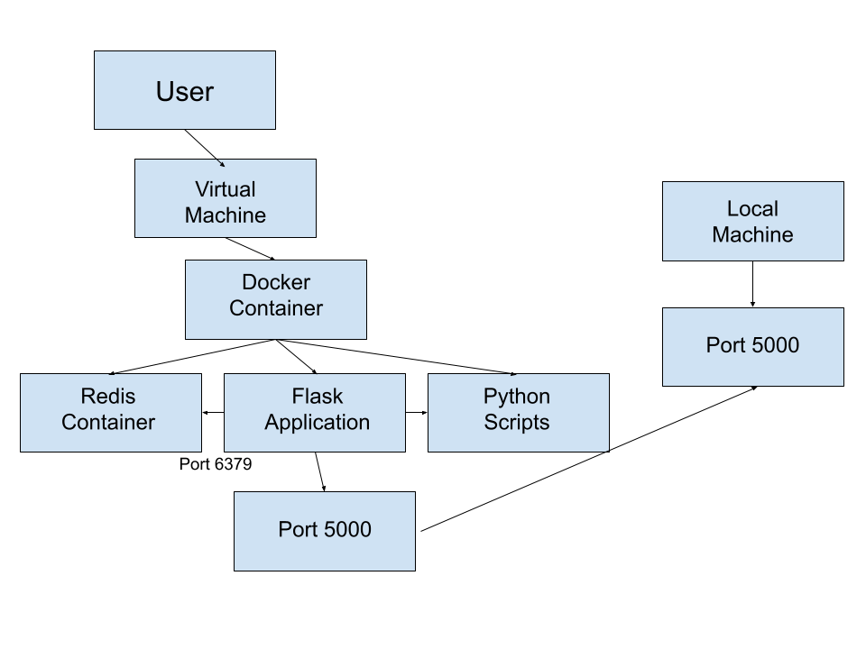

# ISS Tracker App

## Description

This is an ISS Tracker app built with Flask and Redis that tracks the position of the International Space Station (ISS) in real time. The app fetches data from a public ISS API and stores it in a Redis database. It provides a Flask-based API that allows users to query the current position of the ISS, and it also supports containerized unit tests.

The app is deployed using Docker, and it supports both the Flask API and Redis via Docker Compose.

## Citation of ISS Data

The ISS tracking data is fetched from [NASA's Spot the Station Trajectory Data](https://spotthestation.nasa.gov/trajectory_data.cfm). This dataset provides real-time position information for the International Space Station.

## Project Structure

- `iss_tracker.py`: The main Python script running the Flask application and connecting to Redis.
- `Dockerfile`: The Dockerfile used to build the Flask app image.
- `docker-compose.yml`: The Docker Compose file to deploy both the Flask app and Redis in separate containers.
- `requirements.txt`: The list of dependencies required for the project, including Flask, Redis, and other packages like `geopy` and `astropy`.
- `test_iss_tracker.py`: Unit tests for the Flask app.
- `README.md`: This file, providing instructions and descriptio

## How to Build and Run the Docker Container

First, ensure you're in the folder containing the `Dockerfile`, `iss_tracker.py`, and other necessary files. In your terminal (or command prompt), run the following command to build the Docker image:

docker-compose build .

Next, run this command

docker-compose up

## How to Interact With Flask

Open a new terminal to run curl commands. Ensure that you do not close the previous terminal.

In the new terminal, use curl http://localhost:5000/ followed by the different routes in order to run the different functions from the iss_tracker.py script.

curl http://localhost:5000/epochs prints the entire dataset

curl http://localhost:5000/epochs/<int> prints the data for a specific epoch

curl http://localhost:5000/epochs/<int>/speed prints the speed for a specific epoch

curl http://localhost:5000/epochs/<int>/locations prints the location for a specific epoch

curl "http://localhost:5000/epochs?limit=<int>&offset=<int>" prints the data within the specified range

curl http://localhost:5000/now prints the data closest to the current time

AI was used to handle formatting in the README.md file
